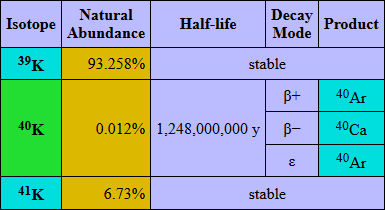

<a href="https://github.com/kaosborn/KaosPhysics/blob/master/.github/workflows/test.yml">
</a>

# KaosPhysics

The KaosPhysics project started with the `elements.html` page
 - an interactive and internationalized Periodic Table of the Elements.
It became necessary to model the required data in a strongly-typed environment so C# was chosen.
The .NET codebase generates JSON for the nuclides table and HTML for the tables themselves.

The term 'nuclides' is used for the elements table because it includes the neutron at index 0, followed by hydrogen, etc.
This allows using an element's atomic number (proton count) as the array index.

### Folder contents

#### Pages folder

The `elements.html` file is an HTML/RSS/JavaScript page that displays the Periodic Table of the Elements.
Stable versions are periodically posted here:

https://kaosborn.github.io/elements.html

The **Elements** web page:

* Displays the Periodic Table of the Elements in either standard, 32-column, or left-step format.
* Provides a plethora of switchable themes.
* Provides full support for multiple languages, including English variants.
* Uses responsive CSS to provide adaptable output without JavaScript.
* Detects user language on page load for best-fit initial setting.
* Is Limited to a single file with no dependencies for ease of distribution and offline functionality.

Work is needed in these areas:

* Improve menus beyond current proof-of-concept state.
* Improve current translations, add more languages.

#### DotGenJson folder

The `DotGenJson` folder contains a .NET Core project that builds `DotGenJson.exe`
for generating machine readable data of the KaosPhysics model.
This program:

* Provides detailed nuclide and isotope information.
* Provides translations of terms to de, en, en-GB, en-US, es, it, ru:
  * Element names
  * Decay mode names
  * Category names
  * Names of states of matter
  * And more

The **Elements** web page (above) uses data from this program's output to produce its content.
For example,
the following potassium isotopes table is built dynamically from data emitted by `DotGenJson.exe`.



See the original page here:

https://kaosborn.github.io/elements.html?theme=stab;z=19

Usage: `DotGenJson.exe [-js]`

Use the `-js` switch to produce JavaScript rather than the default JSON.
See complete output here:

https://kaosborn.github.io/data/kaosNuclides.json

#### DotElements folder

The `DotElements` folder contains a .NET Core project that builds `DotElements.exe`
for generating concise, human readable data of the KaosPhysics model.
This program produces a narrow, fixed-width listing of the elements
followed by fixed-width listings of their isotopes.

Usage: `DotElements.exe [languageCode]`

Provide a language argument (2- or 5-characters) for translations of chemical terms.
For output of the default world-English, see here:

https://kaosborn.github.io/data/kaosNuclides-en.txt

#### DotKaosPhysics

This folder contains a class library build of KaosPhysics in the form of a `.nuget` package.

#### Source folder

This folder contains the C# source to the KaosPhysics model in a shared project.
The preferred way to consume KaosPhysics is to include this shared project directly.

This library source defines the `Kaos.Physics` namespace with 2 classes:

* The `Nuclide` class which consists of the neutron followed by the elements.
* The `Isotope` class which is referenced by the `Nuclide` class.

See the files `Nuclide.cs` and `Isotope.cs` here:

https://github.com/kaosborn/KaosPhysics/tree/master/Source/KaosPhysics

#### TestCore folder

This folder contains a MSTest project that ensures the nuclides table hasn't gotten totally munged.

### JSON data

Here is an excerpt of the JSON emitted by `DotGenJson.exe`:

```json
"nuclides": [
  { "z":  0, "symbol": "n",  "period": 0, "group": 0, "categoryIndex": 7, "block": " ", "occurrenceIndex": 1, "lifeIndex": 0, "discoveryYear": 1932, "discoveryIndex": 4, "stateIndex": 0, "melt":     null, "boil":     null, "weight":   1.000, "stableCount": 0, "stabilityIndex": 4, "isotopes": [{"z":0,"a":1,"abundance":0,"occurrenceIndex":1,"stabilityIndex":4,"decayFlags":4,"halflife":610.1}] },
  { "z":  1, "symbol": "H",  "period": 1, "group": 1, "categoryIndex": 7, "block": "s", "occurrenceIndex": 3, "lifeIndex": 1, "discoveryYear": 1766, "discoveryIndex": 1, "stateIndex": 3, "melt":   13.990, "boil":   20.271, "weight":   1.008, "stableCount": 2, "stabilityIndex": 0, "isotopes": [{"z":1,"a":1,"abundance":99.98,"occurrenceIndex":3}, {"z":1,"a":2,"abundance":0.02,"occurrenceIndex":3}, {"z":1,"a":3,"abundance":0,"occurrenceIndex":1,"stabilityIndex":3,"decayFlags":4,"halflife":388781648.64}] },
  { "z":  2, "symbol": "He", "period": 1, "group":18, "categoryIndex": 9, "block": "s", "occurrenceIndex": 3, "lifeIndex": 0, "discoveryYear": 1868, "discoveryIndex": 2, "stateIndex": 3, "melt":    0.950, "boil":    4.222, "weight":   4.003, "stableCount": 2, "stabilityIndex": 0, "isotopes": [{"z":2,"a":3,"abundance":0.0002,"occurrenceIndex":3}, {"z":2,"a":4,"abundance":99.9998,"occurrenceIndex":3}] },
  { "z":  3, "symbol": "Li", "period": 2, "group": 1, "categoryIndex": 0, "block": "s", "occurrenceIndex": 3, "lifeIndex": 2, "discoveryYear": 1817, "discoveryIndex": 2, "stateIndex": 1, "melt":  453.650, "boil": 1603.000, "weight":   6.940, "stableCount": 2, "stabilityIndex": 0, "isotopes": [{"z":3,"a":6,"abundance":7.59,"occurrenceIndex":3}, {"z":3,"a":7,"abundance":92.41,"occurrenceIndex":3}] }
]
```

Access the chemical elements by indexing the above `nuclides` array by atomic number.
Element names are stored separately in `nuclideNames` for language selection.
Next is a trimmed excerpt of that object:

```json
"nuclideNames": {
  "de"   : [ "Neutron",  "Wasserstoff", "Helium", "Lithium", "..." ],
  "en"   : [ "Neutron",  "Hydrogen",    "Helium", "Lithium", "..." ],
  "en-gb": [ "Neutron",  "Hydrogen",    "Helium", "Lithium", "..." ],
  "en-us": [ "Neutron",  "Hydrogen",    "Helium", "Lithium", "..." ],
  "es"   : [ "Neutrón",  "Hidrógeno",   "Helio",  "Litio",   "..." ],
  "fr"   : [ "Neutron",  "Hydrogène",   "Hélium", "Lithium", "..." ],
  "it"   : [ "Neutrone", "Hydrogène",   "Elio",   "Litio",   "..." ],
  "ru"   : [ "Водород",  "Нейтрон",     "Гелий",  "Литий",   "..." ]
}
```

### Using JSON data

Here is a JavaScript example that shows the symbol for **Z**=2 followed by its name in Spain.

```js
alert ("Symbol=" + nuclides[2].symbol);
alert ("Name in Spain=" + nuclideNames["es"][2]);
```

Keys in the `nuclides` object with the `Index` suffix require a lookup in another object.
Corresponding lookup tables are provided with language translations.

The `isotopes` arrays vary in length depending on isotope radioactivity:

* Stable isotopes
  * Neutron count (*A*)
  * Natural abundance percentage
  * Natural occurrence index
* Radioactive isotopes include 3 more values
  * Stability index
  * Decay mode bitflags
  * Half-life

See tritium (*Z*=1, *A*=3) for an example of a radioactive isotope.

### C# data

The source for the JSON data above is the **KaosPhysics** C# shared project.
Here is an excerpt of a constructor:

```cs
public static Nuclide Hydrogen { get; } = new Nuclide
(
    z: 1, symbol: "H", name: nameof (Hydrogen),
    category: Category.Nonmetal,
    period: 1, group: 1,
    melt: 13.99, boil: 20.271,
    weight: 1.008,
    life: Nutrition.BulkEssential,
    known: 1766, credit: "Henry Cavindish",
    naming: "From Greek, meaning water-former",
    isotopes: new Isotope[] { new Isotope (1, 1, 99.985), new Isotope (1, 2, 0.015), new Isotope (1, 3, 0.0, 12.32*31556952.0, Decay.BetaMinus) },
    nameMap: new Dictionary<string,string> { { "de","Wasserstoff" }, { "es","Hidrógeno" }, { "fr","Hydrogène" }, { "it","Hydrogène" }, { "ru","Нейтрон" } }
);
```

Some properties are calculated at startup
such as the element's stability, occurrence, and weight (for elements with no stable isotope).
State of matter is calculated from the `melt` and `boil` values supplied.

The element constructed above may be accessed as a singleton
but will usually be accessed from the nuclides array (also a singleton).
Actual property names of the object are camel-cased versions of the argument names seen above.

The `name` parameter is the element name for the 'en' language.
Nuclide name translations are provided by the `nameMap` dictionary constructor parameter.
If no entry exists for a language, then it will default to the value for the 'en' language.
At runtime, use the `GetName(string)` method to get the element's name for the supplied language.

```cs
Console.WriteLine ("H name in Spain: " + Nuclide.Table[1].GetName("es"));
```
